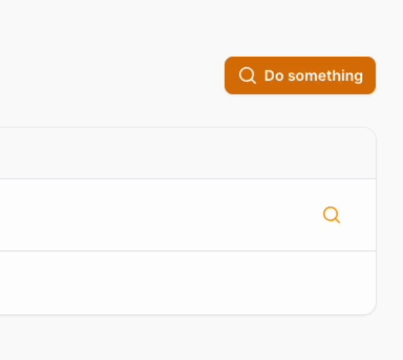

# Hold to confirm to trigger a Filament Action - under development

[](https://packagist.org/packages/rheinbyte/hold-to-confirm)
[](https://github.com/rheinbyte/hold-to-confirm/actions?query=workflow%3Arun-tests+branch%3Amain)
[](https://github.com/rheinbyte/hold-to-confirm/actions?query=workflow%3A"Fix+PHP+code+styling"+branch%3Amain)
[](https://packagist.org/packages/rheinbyte/hold-to-confirm)



## TODO

- Support iconButton and links
- Support alpineClickHandler and href
- Remove wire:ignore
- Use tailwind instead of inline-styles

## Installation

You can install the package via composer:

```bash
composer require rheinbyte/hold-to-confirm
```

## Usage

```php
HoldToConfirmAction::make('do something')
    ->action(fn() => /* Doing something */)
```

## Testing

```bash
composer test
```

## Changelog

Please see [CHANGELOG](CHANGELOG.md) for more information on what has changed recently.

## Contributing

Please see [CONTRIBUTING](.github/CONTRIBUTING.md) for details.

## Security Vulnerabilities

Please review [our security policy](../../security/policy) on how to report security vulnerabilities.

## Credits

- [RheinByte](https://github.com/rheinbyte)
- [All Contributors](../../contributors)

## License

The MIT License (MIT). Please see [License File](LICENSE.md) for more information.
